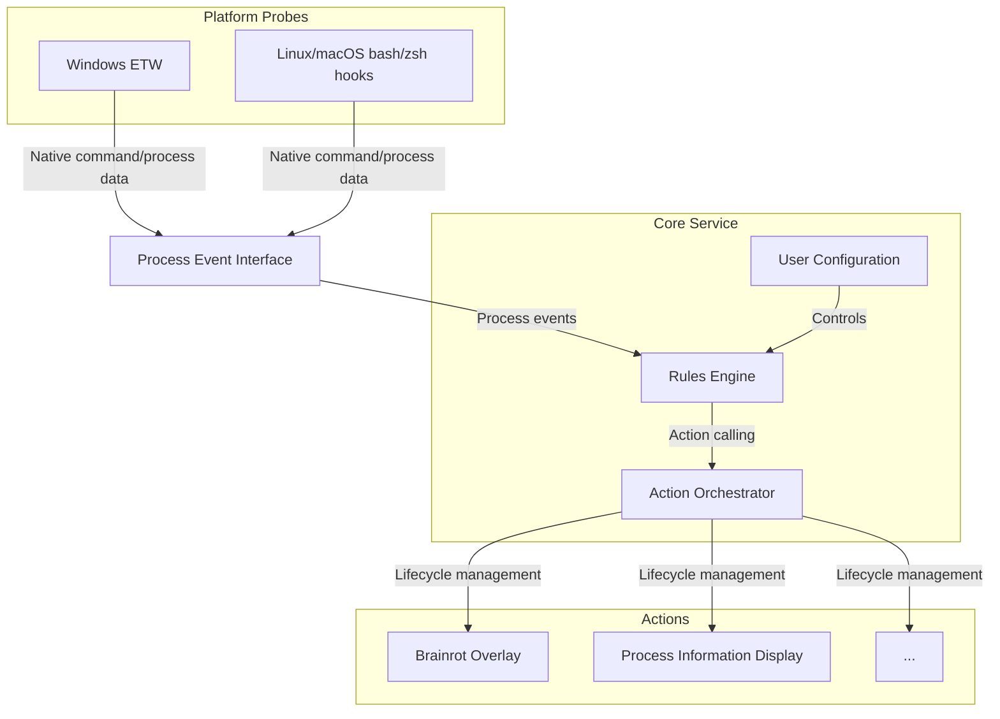

# VibeRot

Some commands take forever to run, and here you have the goated brainrot injector that turns your boring waits into endless doomscrolling sessions. Autoplay TikTok slop, Instagram reels, or whatever degenerate feed you crave, right on top of your screen.

[](https://github.com/endernoke/viberot)
[](https://github.com/endernoke/viberot)
[](https://github.com/endernoke/viberot)
[](https://github.com/endernoke/viberot)
[](https://github.com/endernoke/viberot)
[](https://github.com/endernoke/viberot)

https://github.com/user-attachments/assets/f7010183-602e-4f7a-a94f-7fc94571054d

VibeRot is a background service that sniffs out slow ahh commands like `docker build` or `npm install` and blasts an overlay of pure brainrot. Watch the slop flow until your command finishes, then it will put the fries in the bag. No more productivity guilt; just vibes and rot. You will never have to go touch grass while waiting for deployment again.


The service hooks into OS process or shell command creation, matches your rules, and spawns actions like the overlay. Actions run in parallel and auto-kill when your command wraps up.

## Installation

### Prerequisites
- Rust (you can install from [rust-lang.org/tools/install](https://rust-lang.org/tools/install/))
- Tauri prerequisites (optional but highly recommended): See [https://v2.tauri.app/start/prerequisites/#system-dependencies](https://v2.tauri.app/start/prerequisites/#system-dependencies)

### Building and Installation

> [!CAUTION]
> On Windows, VibeRot requires admin privileges to monitor system processes. Make sure to run the service with the necessary permissions. On Windows, it will prompt for elevation when run.

1. Clone the repo:
   ```bash
   git clone https://github.com/endernoke/viberot
   cd viberot
   ```

2. Build the core and the brainrot overlay:
   ```bash
   cargo build --release  # Core service
   cd actions/overlay
   cargo build --release  # The brainrot window
   cd ../..
   ```

   This may take a while, fortunately this will be the last time you have to endure the pain of waiting for commands to complete. Spend this time wisely.

   Executables will drop here:
   - Windows: `target\release\viberot-service.exe` (and `actions\overlay\target\release/viberot-overlay.exe` for the overlay)
   - Linux/macOS: `target/release/viberot-service` (and `actions/overlay/target/release/viberot-overlay` for the overlay)

4. Fire it up manually: (for Windows, in a **elevated** terminal, or run as admin in the File Explorer GUI)
   ```bash
   ./target/release/viberot-service
   ```

   It'll run in the background and listen for process creation/termination events. You're free to close the elevated terminal now. For auto-start on boot, set it up with Task Scheduler.

> [!TIP]
> On Linux and macOS, VibeRot will ask you to configure your `.bashrc` or `.zshrc` when it runs for the first time. Follow the on-screen instructions to set it up.

5. Exercise your newfound degeneracy

   Run this anywhere:
   ```bash
   cargo build
   ```

   Now add any slow commands you want to the config (see below).

## Configuration

Config lives in TOML at:
- Windows: `%APPDATA%/viberot-service/config.toml`
- Linux/macOS: `~/.config/viberot-service/config.toml`

### Rules
Each rule matches a command pattern and triggers an action (only "exec" type for now: run an exe/script).

```toml
[[rules]]
command = "*cargo.exe build*"  # Glob pattern for the command
[rules.action]
type = "exec"                  # Run this bad boy
path = "path/to/your/rot.exe"  # Absolute, relative, or PATH-resolved
args = ["--arg1", "--arg2"]    # Optional args for extra flavor
single_instance = true         # Optional: No duplicate rot sessions, default false
```

### Default Configuration: Brainrot Overlay on Cargo Build
```toml
[[rules]]
command = "*cargo.exe build*"
[rules.action]
type = "exec"
path = "${VIBEROT_ACTIONS}/overlay/target/release/viberot-overlay.exe"
args = ["--exit-on-stdin-close"]
single_instance = true
```

> [!TIP]  
> **On Windows:**  
> Always use the full command line expansion for processes to watch, e.g. `*npm-cli.js* install*` instead of `npm install*`.  
> **On Linux/macOS:**  
> Expand any aliases you've set, e.g. if you have set `alias ll ls -l`, use `ls -l` if you want to run an action when you type `ll`.

### Path Resolution
- **Paths**: Absolute paths work as-is. Relative paths are from the project root (where `Cargo.toml` lives). Names without paths search the system PATH.
- **Env Vars**: Use `${VAR_NAME}` for expansion. Built-ins: `${VIBEROT_HOME}` (project root), `${VIBEROT_ACTIONS}` (actions dir). System vars like `${USERPROFILE}` work too.

Actions receive these environment variables:
- `VIBEROT_COMMAND`: Full command line
- `VIBEROT_TIMESTAMP`: When the process started (Unix timestamp)
- `VIBEROT_HOME`: Project root path
- `VIBEROT_PID`: ID of the process being watched (**CAUTION**: see [docs/synthetic-pids.md](docs/synthetic-pids.md))

## Bundled VibeRot Actions

In `actions/`, we've got premade degeneracy:

### Brainrot Overlay (`actions/overlay/`) – The magnificant star of the show
Cluely but for brainrot: a Tauri-based, see-through window for unlimited slop:
- Autoplays TikTok (default), but swap to Instagram, Reddit, X, or your fave rot site.
- Transparent and always-on-top
- Closes automatically when your command finishes

Check [actions/overlay/README.md](actions/overlay/README.md) for details.

> [!TIP]  
> Want to scroll reels directly from your terminal? Check out [reels-cli](https://github.com/notMarkMP1/reels-cli) (not affiliated).

### Debug Display (`actions/example/`)
A simple Python/Tkinter GUI showing process info. Great for testing rules or hacking your own actions.

VibeRot is customizable af. You can easily create your own actions in any language that can be executed from the command line. Just make sure your action can handle stdin closing to know when to exit if needed.

You can even make actions to do something *actually productive* while you wait, like opening the unsloth.ai docs or launching a quick leetcode practice in a browser, but this energy isn't encouraged.

Feel free to open PRs that add links here to your own actions.

## Under the Hood: How VibeRot Works

VibeRot's built in Rust for speed and aura.

> [!WARNING]
> I vibe-coded 90% of this. I tried to review everything but I still have no idea how the borrow checker works 💀😭 Please forgive any sins I made and raise them in issues if you find any.

### Architecture



The above diagram looks complex because it tries to be complete.

- **Core service**: Loads config, matches rules, spawns actions.
- **Platform probes**:
   - On Windows, uses ETW (event tracing for Windows). This achieves system-wide process monitoring. (I believe) it wraps the Windows API directly in Rust.
   - On Linux/macOS, uses bash/zsh pre and post-command hooks to watch for command execution. The hooks send data to a Unix socket to communicate with the core service.
- **Actions**: Actions run as independent child processes, and get notified on command exit via stdin close.

### Flow
1. OS detects new process.
2. Service checks rules.
3. If a match is found, ~swipe right~ spawn action in parallel.
4. The stdin of the child process is closed when the watched command exits, signaling the action to clean up.

## Contributing

Contributions are welcome! Here's how to get started:

1. Pay your fanum tax by starring the repo, it means a lot :>
2. Fork the repository
3. Create a feature branch
4. Make your changes and test thoroughly (currently, it's ok to fail on non-Windows platforms)
5. Open a Pull Request with a clear description of your changes (bonus points if it's written in Gen Z/alpha slang)
6. 7

For changes requiring significant design decisions, please open an issue first to discuss your ideas.

Apart from code contributions, you can also help by:

- Reporting bugs and suggesting features
- Testing with different setups and platforms
- Expanding the default config to watch for more long-running commands
- Improving documentation

## License

We firmly believe degeneracy is a fundamental human right and should be free and accessible to all. VibeRot is open source under the MIT License. See [LICENSE](LICENSE).

## Credits

Shoutout to [Jet](https://github.com/supreme-gg-gg) for coming up with the based idea of autoplaying reels while waiting for commands to complete.

Author: [James Zheng](https://github.com/endernoke)